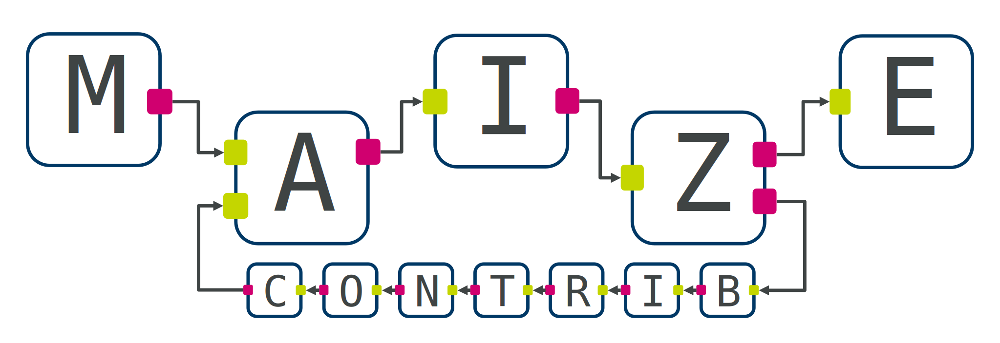

This is a [*namespace package*](https://packaging.python.org/en/latest/guides/packaging-namespace-packages/) for custom nodes and subgraphs for [maize](https://github.com/MolecularAI/maize). Place custom nodes in an appropriate subfolder under `maize/steps/`, following the provided template.

Installation
------------
You can install *maize-contrib* with:

```bash
conda env create -f env-users.yml
conda activate maize
pip install -e ./
```

The first step will install maize (see the [maize documentation](https://molecularai.github.io/maize/quickstart.html#installation) for more information) and all required dependencies. If you plan on developing, you should use `env-dev.yml` instead.

Usage
-----
Simply import the relevant steps from the subpackage:

```python
from maize.steps.mai.example import Example
```

See the [**documentation**](https://molecularai.github.io/maize-contrib/index.html) for details on the included steps and utilities.

Development
-----------
Follow the development guidelines for [maize](https://molecularai.github.io/maize/development.html).

Because this is a namespace package, some development tools (especially linters) can have problems. I have switched from [pylint](https://pylint.readthedocs.io/en/latest/) to [ruff](https://beta.ruff.rs/docs/) which seems to handle these environments with no problems. For [mypy](https://mypy.readthedocs.io/en/stable/) it is important to specify `MYPY_PATH` and `explicit-package-bases` (see also [this issue](https://github.com/python/mypy/issues/8944)). If you're using VSCode, you will want to point `Pylance` to both the `maize` **and** `maize-contrib` package directories, or it will be unable to find `utilities` subpackages.

Status
------
Will be populated with useful steps - priorities:
- Docking (Glide + Autodock)
- Qptuna
- Legacy Icolos
- RBFE (PMX)
- MD (Gromacs)
- Gaussian
